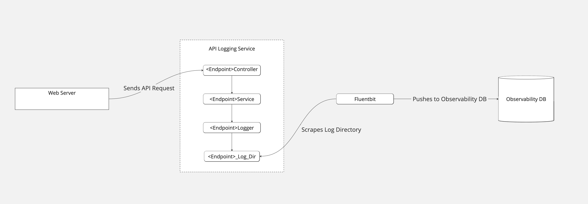

# animated-octo-palm-tree

This project is intended to be a simple service that performs the following

- Receives API Requests from an application 
- Ensures the payloads conform to a specified layout 
- Outputs these to a log that will be scraped by fluentbit and loaded into an external DB
- Fluentbit will then upload these to an external DB that can be queried by an observability platform such as Prometheus

Technologies that will be used for this application
- Spring Framework
- Java 17
- Kotlin for the build.gradle file (just to get some familiarity with it)
- Docker (to containerise this application)
- K8s (to ensure scalability if to be used at a wider scale)

The following technologies will be used for the complete end to end flow, these may change as I work through this
- Fluentbit (to handle the scraping of the log directory)
- Gatling (to test populating payloads at scale as well as overall application performance)
- Prometheus (to handle metrics)
- Grafana Mimir (as our DB)